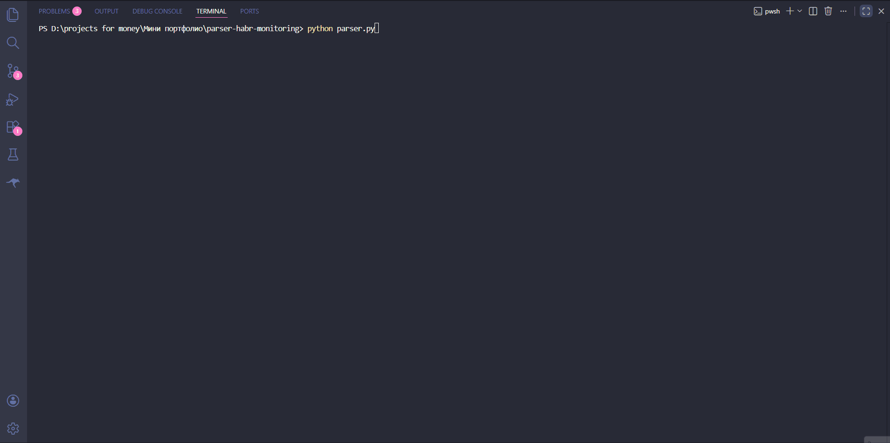
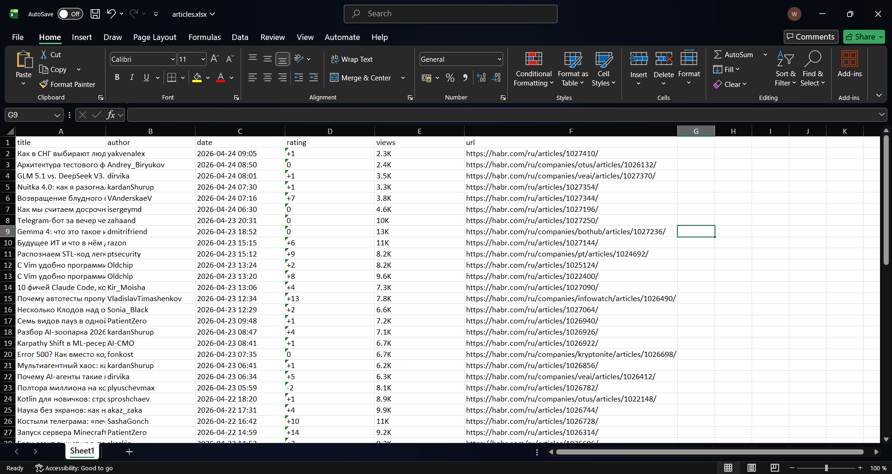

# Habr Articles Parser with Deduplication

Python-скрипт, который собирает свежие статьи с habr.com/ru/hub/programming,
сохраняет их в Excel и не создаёт дублей при повторных запусках.

## Демо



## Особенности

- **Дедупликация через `seen.json`** — при повторных запусках в Excel попадают только новые статьи.
- **Устойчивость к ошибкам** — если страница не загрузилась или поле не нашлось, парсер не падает, а пропускает и идёт дальше.
- **Топ-3 по рейтингу** — после каждого запуска выводит в консоль три самые популярные статьи за прогон.
- **Случайные задержки** между запросами, чтобы не попасть в rate-limit сайта.
- **Готовность к деплою** — можно запускать по расписанию через cron, Windows Task Scheduler или Railway.

## Стек

- Python 3.11+
- requests
- beautifulsoup4
- pandas + openpyxl

## Запуск

```bash
pip install -r requirements.txt
python parser.py
```

## Результат

- `articles.xlsx` — таблица со столбцами: title, author, date, rating, views, url.
- `seen.json` — список уже спарсенных ссылок (для дедупликации).

## Пример выгрузки

